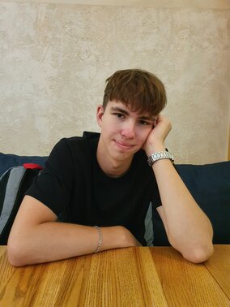

# Andrei Bunchenko

*Future FrontEnd Developer*
*******
## Contacts
* Discord (Andrei Bunchenko#6087)
* Telegram (@bunchenko)
* [LinkedIn](https://www.linkedin.com/in/andrew-bunchenko-1bb505219/) (Andrew Bunchenko)
* Email (andrew.by.one@gmail.com)
*******
## About me
I aim to begin my professional career as FrontEnd Developer and develop in this field. Currently studying at Francisk Skorina Gomel State University, department of Physics and IT. I enjoy my hobbies a lot: listening to music, doing sports, reading books and coding. I am an easy learner, hard-working and productive person. Always excited to work in a big team!
*******
## Skills
* HTML (basics, semantic HTML, block and inline elements)
* CSS (basics)
* JS (basics)
* Git
* Basic PhotoShop and CorelDRAW skills
* Visual Studio Code
*******
## My projects
* HTML+CSS
    + [Another portfolio](https://bunchenko.github.io/my-site/) (with help of HTMLAcademy)
* Graphics
    + [Collage](assets/img/Collage.pdf)
    + [Company logo](assets/img/Company-logo.pdf)
    + [Cover of a magazine](assets/img/cover-mag.pdf)
    + [First page of a magazine](assets/img/first-pg-mag.pdf)
    + [Diploma](assets/img/Diploma.pdf)
*******
## Code example
```
function descendingOrder(n){
  let string = n.toString();
  return Number(string
                .split('')
                .sort((a, b) => Number(b) - Number(a))
                .join(''))
}
```
*******
## Education
Currently studying at Francisk Skorina Gomel State University, department of Physics and IT (freshman).
Completed HTML/CSS courses at [HTMLAcademy.ru](https://htmlacademy.ru/).
90% of the time I teach myself.
*******
## English level
My current English level is B2-C1.
[[EF SET certificate](https://www.efset.org/cert/4hLQMB)] I can get by in any situation I face and read articles or documentations in English.